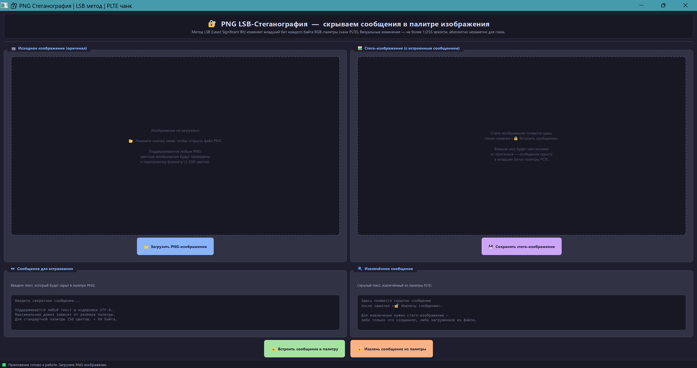

<div align="center">

# 🔐 PNG LSB-Стеганография

### Скрываем сообщения в изображениях — незаметно для глаза

[](https://python.org)
[](https://riverbankcomputing.com/software/pyqt/)
[]()
[]()

<br/>

> 🎓 **Учебный проект** · Кроссплатформенное GUI-приложение на Python + PyQt5  
> Реализует метод **LSB (Least Significant Bit)** для сокрытия текста в палитре PNG-изображений

<br/>



</div>

---

## 📖 О проекте

**PNG LSB-Стеганография** — это десктопное приложение с графическим интерфейсом, которое позволяет незаметно прятать
текстовые сообщения внутри PNG-изображений и извлекать их обратно. Сокрытие происходит путём изменения **младшего бита
** (LSB) каждого RGB-компонента в таблице цветов изображения (чанк `PLTE`).

Изменение на 1 бит из 8 даёт отклонение яркости не более **1/255 ≈ 0.4%** — абсолютно незаметно для человеческого глаза.
При этом данные пикселей изображения **не затрагиваются** — меняется только палитра.

### 🌟 Ключевые возможности

| Возможность                 | Описание                                                                |
|-----------------------------|-------------------------------------------------------------------------|
| 🖼️ **Загрузка PNG**        | Поддержка любых PNG, автоконвертация в палитровый формат (≤ 256 цветов) |
| 🔒 **Встраивание текста**   | Скрытие UTF-8 сообщений в LSB-битах RGB-палитры (чанк PLTE)             |
| 🔓 **Извлечение текста**    | Точное восстановление скрытого сообщения из стего-изображения           |
| 💾 **Сохранение PNG**       | Экспорт стего-изображения с сохранением палитры и всех скрытых данных   |
| 🔍 **Визуальное сравнение** | Одновременный просмотр оригинала и стего-изображения рядом              |
| 🌍 **Кроссплатформенность** | Работает на Windows и Linux, поставляется как единый исполняемый файл   |
| 🌐 **Unicode**              | Поддержка любого текста: кириллица, эмодзи, иероглифы                   |

---

## 🎯 Цели проекта

**1) 🔬 Изучение стеганографии** — практическая реализация метода LSB (Least Significant Bit) для сокрытия данных в
растровых изображениях на примере палитры PNG.

**2) 🖥️ Разработка GUI-приложения** — создание полноценного интерфейса пользователя с использованием **PyQt5** с тёмной
темой оформления (Catppuccin Mocha).

**3) 📦 Кроссплатформенность** — приложение работает на **Windows** и **Linux** и поставляется в виде самодостаточного
`.exe` или бинарного файла без необходимости установки Python.

**4) 🔧 Упаковка и дистрибуция** — формирование навыков сборки Python-проекта в единый исполняемый файл с помощью
**PyInstaller**.

**5) 📏 Визуальная оценка** — возможность сравнить исходное и результирующее изображение бок о бок для наглядной
демонстрации незаметности стеганографии.

---

## ⚙️ Принцип работы

### Метод LSB в палитре PNG

PNG-изображения с типом цвета `ColorType = 3` (палитровый) хранят каждый пиксель как **индекс** в таблице цветов —
палитре `PLTE`. Каждая запись палитры содержит тройку байт `(R, G, B)`.

```
┌────────────────────────────────────────────────────────┐
│  Чанк PLTE (палитра):  256 записей × 3 байта = 768 байт│
│                                                        │
│  Color[0]:  R=128  →  10000000  LSB = 0  ← бит данных  │
│             G=200  →  11001000  LSB = 0  ← бит данных  │
│             B= 50  →  00110010  LSB = 0  ← бит данных  │
│  Color[1]:  R=100  →  01100100  LSB = 0  ← бит данных  │
│  ...                                                   │
└────────────────────────────────────────────────────────┘
```

Алгоритм заменяет **только бит 0 (LSB)** каждого байта RGB — это минимально возможное изменение цвета:

```
Исходный байт:  10110110  = 182
После LSB=1:    10110111  = 183  (разница: +1 из 255)
После LSB=0:    10110110  = 182  (без изменений)
```

### Формат встраиваемых данных

```
┌──────────────────────────────────────────┐
│  2 байта : длина сообщения (uint16 BE)   │
│  N байт  : текст в кодировке UTF-8       │
└──────────────────────────────────────────┘
```

### 📊 Ёмкость канала

| Размер палитры | Бит доступно | Максимум текста (ASCII) | Максимум текста (кириллица) |
|:--------------:|:------------:|:-----------------------:|:---------------------------:|
|    8 цветов    |    24 бит    |        ~1 символ        |              —              |
|    64 цвета    |   192 бит    |       ~22 символа       |        ~11 символов         |
|   128 цветов   |   384 бит    |      ~46 символов       |         ~23 символа         |
| **256 цветов** | **768 бит**  |     **~94 символа**     |      **~47 символов**       |

---

## 📂 Структура проекта

```
steganography/
│
├── 🚀 main.py              — Основная программа (GUI + алгоритм LSB)
├── 📊 tests.py             — Автоматизированные тесты (12 групп, 139 тестов)
├── 📋 requirements.txt     — Зависимости Python
├── 📖 README.md            — Документация проекта
│
├── 🖼️ images/              — Тестовые PNG-изображения для работы с приложением
│
├── 🪟 win/                 — Собранный исполняемый файл для Windows
│   └── Steganography.exe
│
├── 🐧 linux/               — Собранный бинарный файл для Linux
│   └── Steganography
│
├── 🔧 utility/             — Вспомогательные файлы (учебная отчётность)
│
├── 📁 test/                — Артефакты тестирования
│   ├── html-report.html    — HTML-отчёт о прохождении тестов
│   ├── Readme.md           — Markdown-отчёт о тестировании
│   ├── report.pdf          — PDF-отчёт о тестировании
│   └── htmlcov/
│       └── index.html      — Отчёт о покрытии кода тестами
│
└── 📐 setup/               — Документация разработчика алгоритма
    ├── README.md           — Описание архитектуры и алгоритма LSB
    └── README.pdf          — PDF-версия документации разработчика
```

---

## 📍 Требования

### Системные требования

| Компонент                | Требование                                |
|--------------------------|-------------------------------------------|
| 🖥️ Операционная система | Windows 10/11 или Linux (Ubuntu 20.04+)   |
| 🐍 Python                | 3.13+                                     |
| 💾 Свободное место       | ~300 MB (с учётом виртуального окружения) |
| 🧠 Оперативная память    | 256 MB+                                   |

### Зависимости Python

| Библиотека    | Версия  | Назначение                |
|---------------|---------|---------------------------|
| `PyQt5`       | 5.15.11 | GUI-фреймворк             |
| `PyQt5-Qt5`   | 5.15.2  | Библиотеки Qt5            |
| `pytest`      | 9.0.3   | Фреймворк тестирования    |
| `pytest-qt`   | 4.5.0   | Плагин тестирования PyQt5 |
| `pytest-html` | 4.2.0   | HTML-отчёты тестов        |
| `pytest-cov`  | 7.1.0   | Покрытие кода тестами     |

---

## 🚀 Установка и запуск

### 1️⃣ Клонирование репозитория

```shell
# Клонируем репозиторий
git clone https://github.com/a-slelin/steganography.git

# Переходим в папку проекта
cd steganography
```

### 2️⃣ Настройка окружения

```shell
# Создаём виртуальное окружение
python -m venv .venv

# Активируем виртуальное окружение
# Windows:
.venv\Scripts\activate
# Linux / macOS:
source .venv/bin/activate

# Устанавливаем все необходимые библиотеки
pip install -r requirements.txt
```

### 3️⃣ Запуск приложения

```shell
# Windows — активируем окружение и запускаем
.venv\Scripts\activate
python main.py

# Если Qt5 не находит плагины — укажите путь вручную:
$env:QT_QPA_PLATFORM_PLUGIN_PATH = "<путь_к_проекту>\.venv\Lib\site-packages\PyQt5\Qt5\plugins"
python main.py
```

```shell
# Linux — активируем окружение и запускаем
source .venv/bin/activate
python main.py
```

---

## 📦 Сборка исполняемого файла

Используйте **PyInstaller** для упаковки приложения в единый самодостаточный файл без необходимости устанавливать Python
на целевой машине.

### 🪟 Windows → `.exe`

```shell
# Активируем окружение
.venv\Scripts\activate

# Собираем .exe-файл
pyinstaller --noconsole --onefile `
            --name "Steganography" `
            --collect-all PyQt5 `
            --distpath win main.py

# Удаляем временные файлы сборки
rm -rf build/
rm -f Steganography.spec

# Запускаем готовый .exe
win\Steganography.exe
```

### 🐧 Linux → бинарный файл

```shell
# Активируем окружение
source .venv/bin/activate

# Собираем бинарный файл
pyinstaller --noconsole --onefile \
            --name "Steganography" \
            --collect-all PyQt5 \
            --distpath linux main.py

# Удаляем временные файлы сборки
rm -rf build/
rm -f Steganography.spec

# Запускаем готовый бинарник
./linux/Steganography
```

> 💡 **Совет:** Готовые скомпилированные файлы уже находятся в папках `win/` и `linux/` — можно запускать без установки
> Python и зависимостей.

---

## 🖥️ Как пользоваться приложением

```
┌──────────────────────────────────────────────────────────┐
│     🔐 PNG LSB-Стеганография — скрываем в палитре        │
├──────────────────────────────────────────────────────────┤
│                                                          │
│  📷 Исходное изображение  │  🖼️ Стего-изображение        │
│  ┌───────────────────┐    │  ┌───────────────────┐       │
│  │                   │    │  │                   │       │
│  │   [превью PNG]    │    │  │  [превью стего]   │       │
│  │                   │    │  │                   │       │
│  └───────────────────┘    │  └───────────────────┘       │
│  [ 📂 Загрузить PNG ]     │  [ 💾 Сохранить стего ]      │
│                                                          │
│  ✏️ Сообщение для встраивания │ 🔍 Извлечённое сообщение  │
│  ┌─────────────────────┐     │  ┌──────────────────────┐ │
│  │ Введите секрет...   │     │  │ Результат появится   │ │
│  └─────────────────────┘     │  │ здесь...             │ │
│                              │  └──────────────────────┘ │
│     [ 🔒 Встроить ]          │         [ 🔓 Извлечь ]    │
├──────────────────────────────────────────────────────────┤
│  ✅ Приложение готово к работе. Загрузите PNG-изображение│
└──────────────────────────────────────────────────────────┘
```

### Пошаговая инструкция

**Встраивание сообщения:**

1. 📂 Нажмите **«Загрузить PNG-изображение»** и выберите файл
2. ✏️ Введите секретный текст в поле **«Сообщение для встраивания»**
3. 🔒 Нажмите **«Встроить сообщение в палитру»**
4. 💾 Нажмите **«Сохранить стего-изображение»** — готово!

**Извлечение сообщения:**

1. 📂 Нажмите **«Загрузить PNG-изображение»** и выберите стего-файл
2. 🔓 Нажмите **«Извлечь сообщение из палитры»**
3. 🔍 Прочитайте скрытый текст в правом поле

---

## 📊 Тестирование

Проект покрыт **139 автоматизированными тестами** в **12 группах** с использованием `pytest` и `pytest-qt`.

### Запуск тестов

```shell
# Активируем виртуальное окружение перед запуском
.venv\Scripts\activate       # Windows
source .venv/bin/activate    # Linux

# ── Основные команды ────────────────────────────────

# Запуск всех тестов
pytest tests.py -v

# Запуск по маркеру (типу теста)
pytest tests.py -v -m unit          # 🔬 Юнит-тесты функций
pytest tests.py -v -m ui            # 🖥️ Тесты интерфейса
pytest tests.py -v -m integration   # 🔗 Интеграционные тесты
pytest tests.py -v -m edge_cases    # ⚠️ Граничные случаи
pytest tests.py -v -m performance   # ⚡ Тесты производительности

# ── Генерация отчётов ───────────────────────────────

# HTML-отчёт о результатах тестирования
pytest tests.py --html=test/html-report.html --self-contained-html

# Отчёт о покрытии кода (HTML + терминал)
pytest tests.py --cov=. --cov-report=html:test/htmlcov --cov-report=term
```

### Структура тестов

| #  | Группа тестов               |    Маркер     | Тестов  | Что проверяется                           |
|:--:|-----------------------------|:-------------:|:-------:|-------------------------------------------|
| 1  | `TestColorHelperFunctions`  |    `unit`     |   23    | Функции `qRed`, `qGreen`, `qBlue`, `qRgb` |
| 2  | `TestLSBAlgorithmCore`      |    `unit`     |   11    | Чистая логика алгоритма LSB               |
| 3  | `TestUIInitialization`      |     `ui`      |   19    | Начальное состояние главного окна         |
| 4  | `TestButtonStates`          |     `ui`      |   11    | Логика блокировки/разблокировки кнопок    |
| 5  | `TestEmbedMessage`          |     `ui`      |   13    | Метод встраивания сообщения               |
| 6  | `TestExtractMessage`        |     `ui`      |    6    | Метод извлечения сообщения                |
| 7  | `TestFullEmbedExtractCycle` | `integration` |    9    | Полный цикл: встраивание → извлечение     |
| 8  | `TestFileOperations`        | `integration` |   13    | Загрузка и сохранение PNG-файлов          |
| 9  | `TestEdgeCases`             | `edge_cases`  |   11    | Граничные и нетипичные случаи             |
| 10 | `TestErrorHandling`         |     `ui`      |    7    | Обработка ошибочных состояний             |
| 11 | `TestUnicodeMessages`       |    `unit`     |    9    | Unicode, UTF-8, многобайтовые символы     |
| 12 | `TestPerformance`           | `performance` |    7    | Скорость операций встраивания/извлечения  |
|    | **Итого**                   |               | **139** |                                           |

### Результаты тестирования

```
========================================================================== test session starts ===========================================================================
platform win32 -- Python 3.13.7, pytest-9.0.3, pluggy-1.6.0 -- D:\WORK\steganography\.venv\Scripts\python.exe
cachedir: .pytest_cache
metadata: {'Python': '3.13.7', 'Platform': 'Windows-11-10.0.26200-SP0', 'Packages': {'pytest': '9.0.3', 'pluggy': '1.6.0'}, 'Plugins': {'cov': '7.1.0', 'html': '4.2.0', 'metadata': '3.1.1', 'qt': '4.5.0'}, 'JAVA_HOME': 'C:\\Program Files\\Java\\jdk-25'}
PyQt5 5.15.11 -- Qt runtime 5.15.2 -- Qt compiled 5.15.2
rootdir: D:\WORK\steganography
plugins: cov-7.1.0, html-4.2.0, metadata-3.1.1, qt-4.5.0
collected 139 items                                                                                                                                                       

tests.py .............................................................. [ 55%]
......................................................                   [100%]

======================== 139 passed in 4.83s ===============================
```

| Показатель          | Значение      |
|---------------------|---------------|
| ✅ Всего пройдено    | **139 / 139** |
| 📊 Покрытие кода    | **88.7%**     |
| ⏱️ Время выполнения | **4.83 сек**  |

### 📄 Отчёты тестирования

Подробные отчёты о проведённом тестировании доступны в папке `test/`:

- 🌐 [HTML-отчёт о тестах](test/html-report.html) — открыть в браузере
- 🌐 [Покрытие кода](test/htmlcov/index.html) — открыть в браузере
- 📝 [Markdown-отчёт](test/README.md) — подробный текстовый отчёт
- 📄 [PDF-отчёт](test/report.pdf) — для печати и презентации

---

## 🏗️ Архитектура

### Модуль `main.py`

```
SteganoWindow (QMainWindow)
│
├── 🔧 Вспомогательные функции
│   ├── qRed(rgb)          — извлечь красный канал из QRgb
│   ├── qGreen(rgb)        — извлечь зелёный канал из QRgb
│   ├── qBlue(rgb)         — извлечь синий канал из QRgb
│   └── qRgb(r, g, b)      — собрать QRgb из трёх каналов
│
├── 🎨 Интерфейс (_build_ui)
│   ├── Шапка с названием и описанием метода
│   ├── Панель исходного изображения (QLabel + кнопка)
│   ├── Панель стего-изображения (QLabel + кнопка)
│   ├── Поле ввода сообщения (QTextEdit, редактируемое)
│   ├── Поле вывода сообщения (QTextEdit, только чтение)
│   ├── Кнопки действий (Встроить / Извлечь)
│   └── Статусная строка (QStatusBar)
│
├── 📁 Файловые операции
│   ├── load_image()        — загрузка PNG, автоконвертация в Indexed8
│   └── save_stego_image()  — сохранение стего-PNG с PLTE чанком
│
└── 🔐 Алгоритм стеганографии
    ├── embed_message()     — встраивание текста в LSB палитры
    └── extract_message()   — извлечение текста из LSB палитры
```

### Схема состояний

```
[Старт] ──загрузка PNG──► [Изображение загружено]
                                    │
                              ввод текста
                                    │
                                    ▼
                          [Встраивание (embed)]
                                    │
                          ──────────┼──────────
                          │                   │
                    сохранить             извлечь
                          │                   │
                          ▼                   ▼
                   [Файл на диске]    [Текст в поле]
```

---

## 🔖 Версии

| Версия  | Статус       | Описание                             |
|---------|--------------|--------------------------------------|
| **1.0** | 🔥 Завершено | Базовый функционал LSB в палитре PNG |

---

## 🔥 Статус проекта

```
Функциональность     ████████████████████  100%  ✅ Готово
Тестирование         ████████████████████  100%  ✅ Готово
Документация         ████████████████████  100%  ✅ Готово
Сборка (Windows)     ████████████████████  100%  ✅ Готово
Сборка (Linux)       ████████████████████  100%  ✅ Готово
```

---

## 👨‍💻 Разработчики

<div align="center">

| 👤 Участник        | 🐙 GitHub                                    | 🎭 Роль                                      |
|--------------------|----------------------------------------------|----------------------------------------------|
| Гущина Маргарита   | [**@Oycea**](https://github.com/Oycea)       | 🧐 Руководитель проекта, документовед        |
| Разумов Михаил     | [**@Nel4nne**](https://github.com/Nel4nne)   | 🌈 Дизайнер GUI-интерфейса                   |
| Слелин Александр   | [**@a-slelin**](https://github.com/a-slelin) | 💻 Программист, тестировщик                  |
| Гаджигасанов Тимур | [**@soulnier**](https://github.com/soulnier) | 💡 Постановщик задачи, разработчик алгоритма |

</div>

---

## 📚 Дополнительные материалы

- 📖 [Концепция приложения и описание алгоритма](setup/README.md) — постановка задачи, математическое
  обоснование, детальный разбор алгоритма LSB
- 📊 [Подробный отчёт о тестировании](test/README.md) — результаты всех 139 тестов с анализом и рекомендациями
-

🌐 [Стеганография — Википедия](https://ru.wikipedia.org/wiki/%D0%A1%D1%82%D0%B5%D0%B3%D0%B0%D0%BD%D0%BE%D0%B3%D1%80%D0%B0%D1%84%D0%B8%D1%8F) —
теоретическая база

---

<div align="center">

*Сделано с ❤️ в образовательных целях · Python + PyQt5 · 2026*

</div>